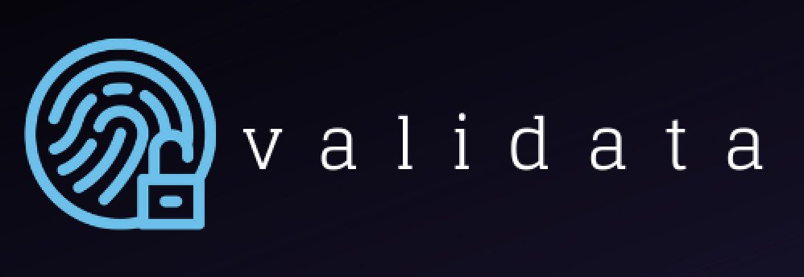

<h1> Validata </h1> 
This is a project that was created during the <a href="https://worldlegalsummit.org/">World Legal Summit (WLS)</a> 
2019 Hackathon and is continuing development through each stage of the global event. The WLS and and other law organizations
involved hope to bridge the gap between law and technology to provide aid to those in need around the world.

 
 

<h1> Team Members </h1>
The Houston, TX team consisted of  
<a href="https://github.com/taliaa10">Taliaa Tauatolo</a>, 
<a href="https://github.com/Umreen24">Umreen Imam</a>, 
<a href="https://github.com/PhilKennedy86">Phillip Kennedy</a>, 
and <a href="https://github.com/RobertMcCutchen">Robert McCutchen</a>

<h1> Focus & Objective </h1>
The focus for the Houston team is Personal Identity and Governance. We are developing an application to assist refugees with professional backgrounds upload and store their documents, identification, and professional credentials for easy access when validating their information. The application will allow for peer-to-peer verification of credentials while also allowing different roles to be assigned to each user (i.e. admin, verification admin, user). Validata offers heavy security through JWTs (JSON Web Tokens) and will implement the use of biometrics as an added measure. The app is a desktop based right now, but will ultimately be moved to mobile. 

<h1> Technologies </h1>
MongoDB, Javascript, JWT, Node.js, HTML, CSS. <i>As this application is in the beginning stages of development, the technologies used may vary as it is worked on</i>. 
